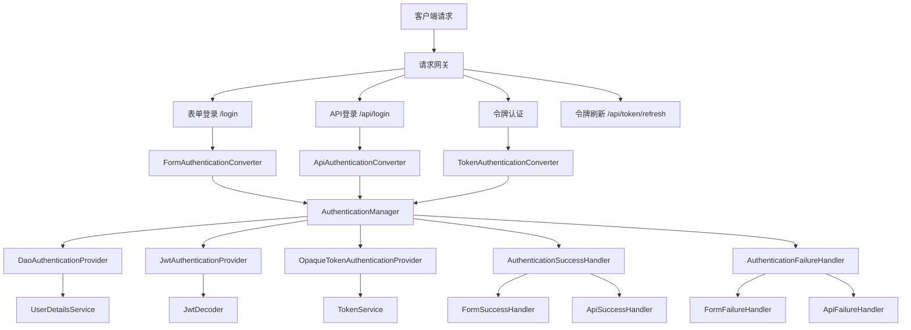

# 设计文档

## 概述

本设计文档基于需求文档，详细描述了 Spring Security 认证授权模块的架构设计。该模块将充分利用 Spring Security 6.5+ 的原生组件和扩展点，实现多种认证方式、动态令牌管理、会话管理等功能。

设计核心原则：
- 最大化使用 Spring Security 原生组件
- 避免直接继承 `OncePerRequestFilter` 或手动操作 `SecurityContextHolder`
- 使用 `AuthenticationConverter -> AuthenticationFilter -> AuthenticationManager -> AuthenticationProvider` 标准认证流程
- 支持有状态和无状态混合架构

## 架构

### 整体架构图



### 核心组件层次

1. **过滤器层 (Filter Layer)**
   - `FormLoginAuthenticationFilter` - 处理表单登录
   - `ApiLoginAuthenticationFilter` - 处理 API JSON 登录
   - `TokenAuthenticationFilter` - 处理令牌认证
   - `RememberMeAuthenticationFilter` - 处理记住我认证

2. **认证转换层 (Converter Layer)**
   - `DelegatingAuthenticationConverter` - 委托转换器
   - `FormAuthenticationConverter` - 表单认证转换
   - `ApiAuthenticationConverter` - API JSON 认证转换
   - `TokenAuthenticationConverter` - 令牌认证转换

3. **认证管理层 (Authentication Manager Layer)**
   - `ProviderManager` - 认证管理器
   - 多个 `AuthenticationProvider` 实现

4. **认证提供者层 (Provider Layer)**
   - `DaoAuthenticationProvider` - 用户名密码认证
   - `JwtAuthenticationProvider` - JWT 令牌认证
   - `OpaqueTokenAuthenticationProvider` - 不透明令牌认证
   - `RememberMeAuthenticationProvider` - 记住我认证

5. **服务层 (Service Layer)**
   - `UserDetailsService` - 用户详情服务
   - `TokenService` - 令牌管理服务
   - `RefreshTokenService` - 刷新令牌服务

## 组件和接口

### 认证转换器 (Authentication Converters)

#### DelegatingAuthenticationConverter
```java
@Component
public class DelegatingAuthenticationConverter implements AuthenticationConverter {
    private final List<AuthenticationConverter> converters;
    
    // 根据请求类型委托给相应的转换器
    // 1. FormAuthenticationConverter - 处理表单请求
    // 2. ApiAuthenticationConverter - 处理 JSON API 请求  
    // 3. TokenAuthenticationConverter - 处理令牌请求
}
```

#### ApiAuthenticationConverter
```java
@Component
public class ApiAuthenticationConverter implements AuthenticationConverter {
    // 解析 JSON 请求体中的 username 和 password
    // 转换为 UsernamePasswordAuthenticationToken
    // 仅处理 /api/login 路径且 Content-Type 为 application/json 的请求
}
```

#### TokenAuthenticationConverter
```java
@Component  
public class TokenAuthenticationConverter implements AuthenticationConverter {
    // 从 Header 或 URL 参数中提取 Access Token
    // 根据令牌格式创建相应的 Authentication 对象：
    // - JWT: BearerTokenAuthenticationToken
    // - UUID: OpaqueTokenAuthenticationToken (自定义)
}
```

### 认证提供者 (Authentication Providers)

#### OpaqueTokenAuthenticationProvider
```java
@Component
public class OpaqueTokenAuthenticationProvider implements AuthenticationProvider {
    private final TokenService tokenService;
    
    // 验证不透明令牌（UUID 类型）
    // 通过 TokenService 查询令牌有效性和关联用户信息
    // 支持 OpaqueTokenAuthenticationToken 类型
}
```

### 认证处理器 (Authentication Handlers)

#### DelegatingAuthenticationSuccessHandler
```java
@Component
public class DelegatingAuthenticationSuccessHandler implements AuthenticationSuccessHandler {
    // 根据请求类型路由到不同的成功处理器：
    // - 表单请求 -> FormAuthenticationSuccessHandler (重定向)
    // - API 请求 -> ApiAuthenticationSuccessHandler (返回 JSON)
}
```

#### ApiAuthenticationSuccessHandler
```java
@Component
public class ApiAuthenticationSuccessHandler implements AuthenticationSuccessHandler {
    private final TokenService tokenService;
    private final RefreshTokenService refreshTokenService;
    private final JwtEncoder jwtEncoder;
    
    // 根据客户端请求偏好生成 JWT 或 UUID 令牌
    // 生成刷新令牌
    // 返回 JSON 格式的令牌响应
}
```

### 令牌服务接口

#### TokenService
```java
public interface TokenService {
    // 存储令牌及其关联信息
    void storeToken(String token, String username, Instant expiration);
    
    // 验证令牌有效性
    TokenValidationResult validateToken(String token);
    
    // 删除令牌
    void deleteToken(String token);
    
    // 生成新的访问令牌
    String generateAccessToken(String username, TokenType type);
}
```

#### RefreshTokenService  
```java
public interface RefreshTokenService {
    // 生成刷新令牌
    String generateRefreshToken(String username);
    
    // 验证刷新令牌
    RefreshTokenValidationResult validateRefreshToken(String refreshToken);
    
    // 刷新访问令牌
    TokenPair refreshAccessToken(String refreshToken, TokenType preferredType);
    
    // 撤销刷新令牌
    void revokeRefreshToken(String refreshToken);
}
```

## 数据模型

### 令牌相关模型

#### TokenType (枚举)
```java
public enum TokenType {
    JWT,    // JWT 访问令牌
    UUID    // UUID 不透明令牌
}
```

#### TokenValidationResult
```java
public record TokenValidationResult(
    boolean valid,
    String username,
    Instant expiration,
    String errorMessage
) {}
```

#### TokenPair
```java
public record TokenPair(
    String accessToken,
    String refreshToken,
    TokenType tokenType,
    long expiresIn
) {}
```

#### OpaqueTokenAuthenticationToken (自定义)
```java
public class OpaqueTokenAuthenticationToken extends AbstractAuthenticationToken {
    private final String token;
    private final Object principal;
    
    // 用于不透明令牌认证的自定义 Authentication 实现
}
```

### 配置属性模型

#### SecurityProperties
```java
@ConfigurationProperties(prefix = "security")
public class SecurityProperties {
    private Token token = new Token();
    private Session session = new Session();
    private RememberMe rememberMe = new RememberMe();
    
    public static class Token {
        private Duration accessTokenExpiration = Duration.ofMinutes(30);
        private Duration refreshTokenExpiration = Duration.ofDays(7);
        private String jwtSecret;
        private String jwtIssuer = "lore-core";
    }
    
    public static class Session {
        private boolean stateful = true;
        private String redisNamespace = "lore:session";
    }
    
    public static class RememberMe {
        private String key = "lore-remember-me";
        private Duration tokenValiditySeconds = Duration.ofDays(14);
    }
}
```

## 错误处理

### 认证入口点 (Authentication Entry Points)

#### DelegatingAuthenticationEntryPoint
```java
@Component
public class DelegatingAuthenticationEntryPoint implements AuthenticationEntryPoint {
    // 根据请求类型返回不同的错误响应：
    // - 表单请求：重定向到登录页面
    // - API 请求：返回 JSON 错误响应
}
```

### 访问拒绝处理器

#### DelegatingAccessDeniedHandler  
```java
@Component
public class DelegatingAccessDeniedHandler implements AccessDeniedHandler {
    // 根据请求类型处理访问拒绝：
    // - 表单请求：重定向到错误页面
    // - API 请求：返回 JSON 错误响应
}
```

### 错误响应格式

#### API 错误响应
```json
{
    "error": "unauthorized",
    "error_description": "访问令牌已过期",
    "timestamp": "2024-01-01T12:00:00Z"
}
```

## 测试策略

### 单元测试

1. **转换器测试**
   - 测试各种请求格式的正确转换
   - 测试边界条件和异常情况

2. **提供者测试**
   - 测试认证逻辑的正确性
   - 测试令牌验证逻辑

3. **服务测试**
   - 测试令牌生成和验证
   - 测试刷新令牌逻辑

### 集成测试

1. **认证流程测试**
   - 表单登录端到端测试
   - API 登录端到端测试
   - 令牌认证测试

2. **安全配置测试**
   - CSRF 保护测试
   - 会话管理测试
   - 记住我功能测试

### 性能测试

1. **令牌验证性能**
   - JWT 解析性能
   - 不透明令牌查询性能

2. **并发认证测试**
   - 高并发登录测试
   - 令牌刷新并发测试

## 安全考虑

### 令牌安全

1. **JWT 安全**
   - 使用强密钥签名
   - 设置合理的过期时间
   - 避免在 JWT 中存储敏感信息

2. **刷新令牌安全**
   - 使用加密安全的随机生成器
   - 实现令牌轮换机制
   - 支持令牌撤销

### 会话安全

1. **会话固定攻击防护**
   - 登录成功后更换会话 ID
   - 使用 Spring Security 的会话固定保护

2. **会话劫持防护**
   - 使用 HTTPS
   - 设置安全的 Cookie 属性

### CSRF 防护

1. **选择性 CSRF 保护**
   - 表单登录启用 CSRF
   - API 端点禁用 CSRF
   - 使用 RequestMatcher 精确控制

## 部署配置

### 应用配置示例

```yaml
security:
  token:
    access-token-expiration: PT30M
    refresh-token-expiration: P7D
    jwt-secret: ${JWT_SECRET:your-secret-key}
    jwt-issuer: lore-core
  session:
    stateful: true
    redis-namespace: "lore:session"
  remember-me:
    key: ${REMEMBER_ME_KEY:lore-remember-me}
    token-validity-seconds: P14D

spring:
  session:
    store-type: redis
    redis:
      namespace: ${security.session.redis-namespace}
```

### Redis 配置

```yaml
spring:
  data:
    redis:
      host: ${REDIS_HOST:localhost}
      port: ${REDIS_PORT:6379}
      password: ${REDIS_PASSWORD:}
      database: ${REDIS_DATABASE:0}
```

这个设计充分利用了 Spring Security 的原生组件和扩展点，避免了直接继承底层过滤器，确保了与框架的良好集成和可维护性。